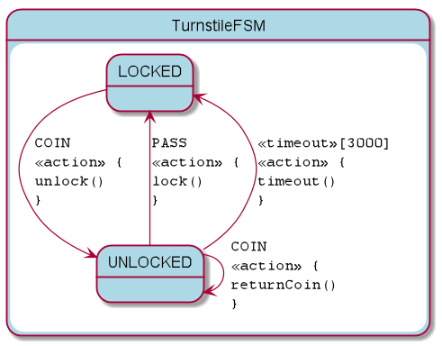

= KFSM Turnstile Sample for Browser

A simple application to demonstrate implementing [KFSM](https://github.com/open-jumpco/kfsm) with the classic Turnstile FSM.

This implementation uses Kotlin code to manipulate the register event handlers on the buttons and manipulate the DOM to update the display state of the elements.

```bash
./gradlew build
```

All the files needed to run will be in `build/dist`

Or you can launch it using

```bash
./gradlew browserRun
```

This FSM has been updated to support a timeout.

The Turnstile will only remain unlocked for 3000ms and then the timeout will be triggered.

The FSM DSL is as follows:

[source,kotlin]
----
asyncStateMachine(
    TurnstileState.values().toSet(),
    TurnstileEvent.values().toSet(),
    Turnstile::class
) {
    initialState { if (locked) TurnstileState.LOCKED else TurnstileState.UNLOCKED }
    default {
        action { _, _, _ ->
            alarm()
        }
    }
    whenState(TurnstileState.LOCKED) {
        onEvent(TurnstileEvent.COIN to TurnstileState.UNLOCKED) {
            unlock()
        }
    }
    whenState(TurnstileState.UNLOCKED) {
        onEvent(TurnstileEvent.PASS to TurnstileState.LOCKED) {
            lock()
        }
        onEvent(TurnstileEvent.COIN) {
            returnCoin()
        }
        timeout(LOCKED, 3000) {
            timeout()
        }
    }
}
----
== Generated State Table

=== TurnstileFSM State Map

|===
| Start | Event[Guard] | Target | Action

| LOCKED
| COIN
| UNLOCKED
a| [source,kotlin]
----
{
unlock()
}
----

| UNLOCKED
| PASS
| LOCKED
a| [source,kotlin]
----
{
lock()
}
----

| UNLOCKED
| COIN
| UNLOCKED
a| [source,kotlin]
----
{
returnCoin()
}
----

| UNLOCKED
| <<timeout>>[3000]
| LOCKED
a| [source,kotlin]
----
{
timeout()
}
----
|===

=== Generated State Diagram



To learn more about visualization visit link:https://github.com/open-jumpco/kfsm-viz[kfsm-viz] and
link:https://github.com/open-jumpco/kfsm-viz-plugin[kfsm-viz-plugin]
